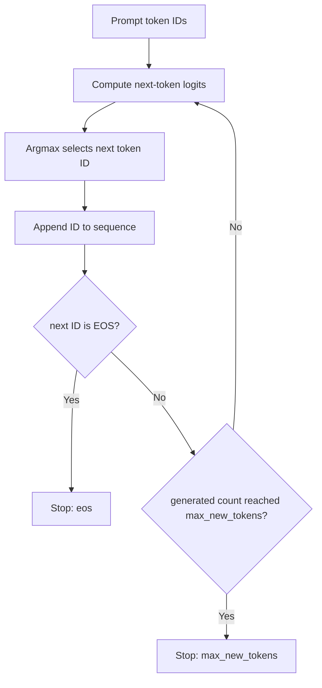

# Inference Basics: Tokenization and Greedy Autoregressive Generation

- **Date**: 2026-07-16
- **Scope**: tokenizer behavior and deterministic greedy generation control flow
- **Repository evidence**:
  - `results/w01/tokenizer_probe.json`
  - `results/w01/autoregressive_toy.json`
  - reviewed through `b91f3aa6a73007c1cd93dd7227807d6f571899a3`
- **Non-goals**: real model logits, model weights, GPU performance, prefill/decode timing, KV Cache measurement, batching, or online Serving behavior

## 1. Text → Token → ID

A language model does not directly consume raw strings. The tokenizer converts text into the numerical representation expected by the model:

```text
raw text
  → tokenizer applies its tokenization rules
  → token strings
  → vocabulary lookup
  → token IDs
```

A **token** is a unit produced by a particular tokenizer. It may be a word, a subword, punctuation, whitespace-bearing fragment, character, or byte-like unit. It is not generally equal to a human word or a Unicode character.

A **vocabulary** is the tokenizer-specific mapping between token strings and integer IDs. A **token ID** is therefore meaningful only together with the corresponding tokenizer and vocabulary. The same integer can represent different tokens in different vocabularies.

Encoding consists of two logical steps:

1. split or transform the input into tokens according to the tokenizer rules;
2. map those tokens to IDs using the tokenizer vocabulary.

Decoding applies the tokenizer's reconstruction rules to IDs and produces readable text. It is not generally equivalent to concatenating the visible token strings, because token strings may contain tokenizer-specific whitespace or byte markers.

### 1.1 Observed tokenizer data

The probe used `Qwen/Qwen2.5-0.5B-Instruct` on four fixed inputs.

| Case | Python characters | Tokens without special tokens | Tokens with special tokens | IDs equal | Decode matches input |
|---|---:|---:|---:|---|---|
| `english_sentence` | 43 | 9 | 9 | Yes | Yes / Yes |
| `chinese_sentence` | 25 | 12 | 12 | Yes | Yes / Yes |
| `python_signature` | 39 | 11 | 11 | Yes | Yes / Yes |
| `mixed_unicode` | 11 | 7 | 7 | Yes | Yes / Yes |

These observations demonstrate that character count is not token count. The 43-character English sentence produced 9 tokens, while the 25-character Chinese sentence produced 12 tokens. This is evidence about these exact inputs and this exact tokenizer; it is not a general claim that one language always uses more tokens than another.

For all four inputs, `add_special_tokens=False` and `True` produced identical IDs in the current probe. That does **not** make the setting irrelevant. Other tokenizers, input formats, or chat templates may add control tokens, so a benchmark must still record and hold this setting constant.

All eight records decoded back to the original input. This establishes round-trip behavior for the tested inputs, not a universal guarantee for arbitrary normalization rules or tokenizer configurations.

## 2. Logits → Next Token

For autoregressive generation, a model uses the current prefix to produce a vector of scores for the next token position. These scores are called **logits**.

```text
current token IDs
  → model forward computation
  → one logit per vocabulary entry
  → decoding strategy selects next token ID
```

If the vocabulary contains `V` entries, the next-token logits contain `V` scores. In greedy decoding, the selected ID is the index of the maximum logit:

```text
next_token_id = argmax(logits)
```

Greedy decoding is deterministic when the model state, input, numeric behavior, and tie handling are fixed. It chooses the highest-scoring token at the current step; it does not prove that the complete generated sequence is globally optimal.

### 2.1 Minimal greedy loop

```text
sequence = copy(prompt_ids)
repeat at most max_new_tokens times:
    logits = model_or_transition(sequence)
    next_id = argmax(logits); append next_id to sequence
    stop if next_id is EOS or the new-token limit is reached
return prompt IDs, generated IDs, final IDs, and stop reason
```



## 3. Two Deterministic Stop Paths

The project toy uses a five-entry vocabulary:

| ID | Token |
|---:|---|
| 0 | `<bos>` |
| 1 | `I` |
| 2 | ` like` |
| 3 | ` cats` |
| 4 | `<eos>` |

The prompt is `[0, 1]`, the EOS token ID is `4`, and `max_new_tokens` is `5`.

### 3.1 EOS path

```text
prompt_ids    = [0, 1]
generated_ids = [2, 3, 4]
final_ids     = [0, 1, 2, 3, 4]
step count    = 3
stop_reason   = "eos"
```

The third generated ID is the EOS ID, so generation stops before reaching the length limit.

### 3.2 Length path

```text
prompt_ids    = [0, 1]
generated_ids = [2, 3, 2, 3, 2]
final_ids     = [0, 1, 2, 3, 2, 3, 2]
step count    = 5
stop_reason   = "max_new_tokens"
```

This transition table never selects EOS. Generation stops immediately after the fifth new token is appended.

### 3.3 Stop-condition priority

After appending a new token, the toy checks conditions in this order:

1. if `next_id == eos_token_id`, use `stop_reason="eos"`;
2. otherwise, if generated-token count reaches `max_new_tokens`, use `stop_reason="max_new_tokens"`.

Therefore, if EOS is generated exactly at the length boundary, the semantic reason remains `eos`.

## 4. Serving Implications

### 4.1 Input tokens are a prefill workload proxy

In standard decoder-only inference, the service first processes the prompt tokens and establishes the state required for generation, including the prompt-side KV Cache. This stage is commonly called **prefill**.

More input tokens usually imply more prefill work and more KV Cache state. However, input-token count is only a workload proxy. Actual cost also depends on the model, attention implementation, hardware, numeric precision, batch composition, prefix reuse, cache hits, and scheduler behavior.

### 4.2 Output tokens are a decode-iteration proxy

After prefill, standard autoregressive decoding extends the sequence step by step. The basic greedy toy generates one new token per loop iteration, so output-token count is an important proxy for the number of sequential decode iterations.

This relationship is central to latency and capacity planning, but it is not the complete performance model. Real systems may batch requests, reuse KV state, apply optimized kernels, or use methods that produce or verify multiple candidate tokens.

### 4.3 Why request count and string length are insufficient

Counting requests alone treats very different workloads as equivalent. Ten requests with short prompts and short outputs are not the same workload as ten requests with long prompts and long outputs.

Character count is also insufficient because tokenization depends on the tokenizer and input content. In the current evidence:

```text
43 English characters → 9 tokens
25 Chinese characters → 12 tokens
```

A useful benchmark therefore records at least:

```text
input token count
requested or observed output token count
request count and concurrency
model and tokenizer identity
input construction and special-token policy
```

Later stages will add timing, queueing, batching, and memory metrics.

### 4.4 Token count is not complete compute cost

Two requests with the same token counts can still have different performance because of:

- model parameter count and architecture;
- precision and quantization;
- GPU type and memory bandwidth;
- batch size and concurrent-request mix;
- scheduler and continuous-batching behavior;
- KV Cache allocation, reuse, eviction, and fragmentation;
- prefix caching;
- framework, kernel, serialization, and network overhead.

Token counts describe workload size. They do not by themselves explain end-to-end latency or throughput.

## 5. Common Misconceptions

### 5.1 One character equals one token

False. Tokens are created by tokenizer-specific rules. The project data directly shows different character-to-token relationships across four inputs.

### 5.2 One token equals one word

False. A token can represent a word, subword, punctuation mark, whitespace-bearing segment, character, or byte-like fragment.

### 5.3 A token ID has universal meaning

False. IDs are indices in a particular vocabulary. The tokenizer/model pairing must be fixed and recorded.

### 5.4 `tokenizer.decode()` is the Serving decode phase

False. `tokenizer.decode()` converts IDs back to text. The Serving **decode phase** repeatedly computes next-token logits and appends generated tokens.

### 5.5 Greedy search finds the globally best sequence

False. Greedy search makes the locally highest-scoring choice at each step. It is deterministic under fixed conditions, but it does not search all possible sequences.

### 5.6 Equal output tokens per second means equal visible text speed

Not necessarily. Different tokenizers and texts can encode different amounts of visible text per token, so equal token throughput can correspond to different character or word throughput.

## 6. Boundaries and Open Questions

The current evidence establishes:

- text→token→ID behavior for four fixed inputs and one Qwen tokenizer;
- deterministic greedy control flow;
- EOS and `max_new_tokens` stop paths;
- stable JSON traces for both experiments.

It does not establish:

- logits or generated text from a real language model;
- measured prefill latency, time to first token, inter-token latency, or throughput;
- GPU utilization or memory behavior;
- KV Cache size, allocation, reuse, or eviction;
- effects of batching, concurrency, queueing, or network transport;
- production behavior of vLLM, SGLang, or another Serving engine.

The next knowledge step is to connect this control-flow foundation to prefill, decode, KV Cache, TTFT, TPOT/ITL, throughput, and queueing measurements.

## 7. Sources

### Project evidence

- `results/w01/tokenizer_probe.json`
- `results/w01/autoregressive_toy.json`
- `experiments/w01/tokenizer_probe.py`
- `experiments/w01/autoregressive_toy.py`

### Primary documentation

- Hugging Face LLM Course, **Tokenizers**: <https://huggingface.co/learn/llm-course/chapter2/4>
- Hugging Face Transformers 5.13.1, **Generation strategies — Greedy search**: <https://huggingface.co/docs/transformers/v5.13.1/en/generation_strategies>
