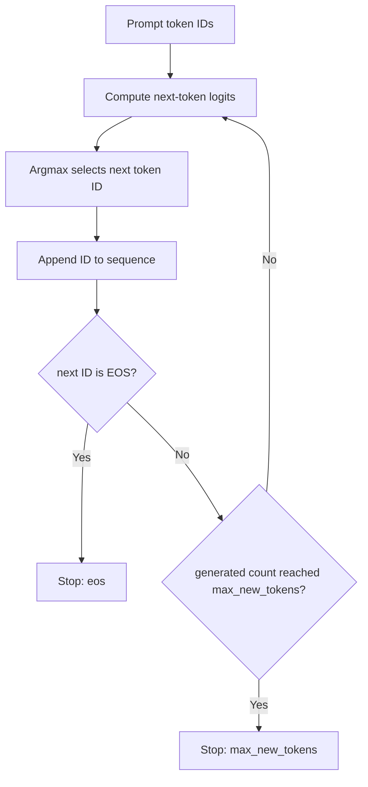

# Inference Basics: Tokenization and Greedy Autoregressive Generation

- **日期**：2026-07-16
- **范围**：tokenizer 行为与确定性 greedy 自回归生成控制流
- **仓库证据**：
  - `results/w01/tokenizer_probe.json`
  - `results/w01/autoregressive_toy.json`
  - 已评审至 `b91f3aa6a73007c1cd93dd7227807d6f571899a3`
- **非目标**：真实模型 logits、模型权重、GPU 性能、prefill/decode 计时、KV Cache 测量、batching 或在线 Serving 行为

## 1. Text → Token → ID

语言模型不能直接处理原始字符串。Tokenizer 负责把文本转换成模型使用的数值表示：

```text
raw text
  → tokenizer 按固定规则切分或变换
  → token strings
  → vocabulary lookup
  → token IDs
```

**Token** 是某个 tokenizer 产生的基本单位。它可能是单词、子词、标点、带空格的片段、字符或 byte-like 单元，因此不能默认等于“一个单词”或“一个 Unicode 字符”。

**Vocabulary** 是 token string 与整数 ID 之间的 tokenizer-specific 映射。**Token ID** 只有与对应 tokenizer 和 vocabulary 一起使用时才有意义；不同 vocabulary 中相同的整数可能表示不同 token。

Encoding 在逻辑上包含两步：

1. 根据 tokenizer 规则把文本转换成 tokens；
2. 使用 vocabulary 把 tokens 映射成 IDs。

Decoding 则使用 tokenizer 的重组规则把 IDs 转回可读文本。它通常不能用简单的 `"".join(tokens)` 代替，因为 token string 可能包含 tokenizer 特有的空格标记、子词标记或 byte 表示。

### 1.1 Observed tokenizer data

本次 probe 使用 `Qwen/Qwen2.5-0.5B-Instruct` tokenizer，对四条固定输入分别执行 `add_special_tokens=False/True`。

| Case | Python 字符数 | False token 数 | True token 数 | IDs 相同 | Decode 恢复原文 |
|---|---:|---:|---:|---|---|
| `english_sentence` | 43 | 9 | 9 | Yes | Yes / Yes |
| `chinese_sentence` | 25 | 12 | 12 | Yes | Yes / Yes |
| `python_signature` | 39 | 11 | 11 | Yes | Yes / Yes |
| `mixed_unicode` | 11 | 7 | 7 | Yes | Yes / Yes |

这些数据直接证明：**字符数不等于 token 数**。当前英文句子有 43 个 Python 字符但只有 9 个 token；中文句子有 25 个字符却有 12 个 token。

这个结果只适用于当前 tokenizer、当前四条文本和当前调用方式，不能外推为“某种语言普遍比另一种语言更耗 token”。

当前四组输入中，`add_special_tokens=False/True` 得到了相同 IDs。但这不代表该参数可以从 benchmark 中省略。其他 tokenizer、输入格式或 chat template 可能插入控制 token，因此 benchmark 仍必须固定并记录该设置。

八条记录均 decode 回原始文本。这只证明当前样本的 round-trip 行为，不保证任意 tokenizer 配置、normalization 规则或输入都能逐字符恢复。

## 2. Logits → Next Token

在自回归生成中，模型根据当前完整前缀，为下一个位置产生一组分数，这组分数称为 **logits**：

```text
current token IDs
  → model forward computation
  → one logit per vocabulary entry
  → decoding strategy selects next token ID
```

如果 vocabulary 大小为 `V`，下一 token 的 logits 长度也应为 `V`。Greedy decoding 选择最大 logit 所在的索引：

```text
next_token_id = argmax(logits)
```

当模型状态、输入、数值行为和并列处理规则固定时，greedy decoding 是确定性的。但它只是在当前一步选择最高分 token，不保证完整序列是全局最优。

### 2.1 Minimal greedy loop

```text
sequence = copy(prompt_ids)
repeat at most max_new_tokens times:
    logits = model_or_transition(sequence)
    next_id = argmax(logits); append next_id to sequence
    stop if next_id is EOS or the new-token limit is reached
return prompt IDs, generated IDs, final IDs, and stop reason
```



## 3. Stop Conditions

项目 toy 使用以下固定 vocabulary：

| ID | Token |
|---:|---|
| 0 | `<bos>` |
| 1 | `I` |
| 2 | ` like` |
| 3 | ` cats` |
| 4 | `<eos>` |

公共设置：

```text
prompt_ids = [0, 1]
eos_token_id = 4
max_new_tokens = 5
```

### 3.1 EOS path

```text
generated_ids = [2, 3, 4]
final_ids     = [0, 1, 2, 3, 4]
step count    = 3
stop_reason   = "eos"
```

第三个新 token 的 ID 为 `4`，即 EOS，因此在达到长度上限前停止。

### 3.2 Length path

```text
generated_ids = [2, 3, 2, 3, 2]
final_ids     = [0, 1, 2, 3, 2, 3, 2]
step count    = 5
stop_reason   = "max_new_tokens"
```

该 transition table 始终不会选中 EOS，因此在 append 第五个新 token 后达到上限并停止。

### 3.3 Priority

每一步 append 完成后，停止判断顺序为：

1. 若 `next_id == eos_token_id`，停止原因为 `eos`；
2. 否则，若新增 token 数达到 `max_new_tokens`，停止原因为 `max_new_tokens`。

因此，如果 EOS 恰好在长度边界被生成，语义上的停止原因仍应记录为 `eos`。

## 4. Serving Implications

### 4.1 Input tokens are a prefill workload proxy

在标准 decoder-only 推理中，服务首先处理 prompt tokens，并建立后续生成需要的状态，包括 prompt 对应的 KV Cache。该阶段通常称为 **prefill**。

输入 token 越多，通常意味着更多 prefill 工作和更多 KV Cache 状态。但 input-token count 只是 workload proxy。实际成本还会受到模型结构、attention 实现、硬件、数值精度、batch 组成、prefix reuse、cache hit 和调度器行为影响。

### 4.2 Output tokens are a decode-iteration proxy

Prefill 之后，标准自回归 decode 逐步扩展序列。当前 greedy toy 每轮生成一个新 token，因此 output-token count 是顺序 decode 迭代次数的重要 proxy。

这对延迟和容量规划很关键，但仍不是完整性能模型。真实系统可能合并不同请求、复用 KV 状态、使用优化 kernel，或采用一次提出/验证多个候选 token 的方法。

### 4.3 Why request count and string length are insufficient

仅统计请求数会把差异巨大的 workload 当成相同工作量。十个短 prompt、短输出请求，与十个长 prompt、长输出请求显然不是同一负载。

字符串长度也不足以替代 token 数，因为 tokenization 取决于 tokenizer 和输入内容。当前证据是：

```text
43 English characters → 9 tokens
25 Chinese characters → 12 tokens
```

因此，Serving benchmark 至少应记录：

```text
input token count
requested or observed output token count
request count and concurrency
model and tokenizer identity
input construction and special-token policy
```

后续阶段再增加 timing、queueing、batching 和 memory 指标。

### 4.4 Token count is not complete compute cost

即使两个请求的 input/output token 数相同，实际性能仍可能不同，原因包括：

- 模型参数量与架构；
- 精度与量化方式；
- GPU 型号与内存带宽；
- batch size 与并发请求组成；
- 调度器和 continuous batching；
- KV Cache 分配、复用、驱逐和碎片；
- prefix caching；
- 框架、kernel、序列化和网络开销。

Token 数描述 workload 规模，但不能单独解释端到端 latency 或 throughput。

## 5. Common Misconceptions

### 5.1 一个字符等于一个 token

错误。Token 由 tokenizer-specific 规则产生，当前四组数据已直接反例验证。

### 5.2 一个 token 等于一个单词

错误。Token 可能是单词、子词、标点、带空格片段、字符或 byte-like 单元。

### 5.3 Token ID 具有跨模型的统一含义

错误。ID 是特定 vocabulary 的索引，必须固定 tokenizer/model pairing。

### 5.4 `tokenizer.decode()` 就是 Serving decode phase

错误。`tokenizer.decode()` 是 IDs→text。Serving 的 **decode phase** 是不断计算 next-token logits、选择 ID 并 append 的生成阶段。

### 5.5 Greedy search 找到全局最优序列

错误。Greedy search 只做逐步局部最高分选择。

### 5.6 相同 output tokens/s 意味着相同可见文本速度

不一定。不同 tokenizer 和文本中，每个 token 承载的可见字符或词数量不同，因此相同 token throughput 可能对应不同的字符/词输出速度。

## 6. Boundaries and Open Questions

当前证据能够说明：

- 一个 Qwen tokenizer 对四类固定输入的 text→token→ID 行为；
- 确定性的 greedy 自回归控制流；
- EOS 和 `max_new_tokens` 两种停止路径；
- 两个实验均具有稳定 JSON trace。

当前证据不能说明：

- 真实语言模型的 logits 或生成质量；
- 实际 prefill latency、TTFT、ITL、TPOT 或吞吐；
- GPU utilization 和显存行为；
- KV Cache 大小、分配、复用或驱逐；
- batching、并发、排队或网络传输的影响；
- vLLM、SGLang 或其他 Serving engine 的生产行为。

下一步需要把当前控制流基础连接到 prefill、decode、KV Cache、TTFT、TPOT/ITL、throughput 和 queueing 的定义与测量。

## 7. Sources

### Project evidence

- `results/w01/tokenizer_probe.json`
- `results/w01/autoregressive_toy.json`
- `experiments/w01/tokenizer_probe.py`
- `experiments/w01/autoregressive_toy.py`

### Primary documentation

- Hugging Face LLM Course, **Tokenizers**: <https://huggingface.co/learn/llm-course/chapter2/4>
- Hugging Face Transformers 5.13.1, **Generation strategies — Greedy search**: <https://huggingface.co/docs/transformers/v5.13.1/en/generation_strategies>
